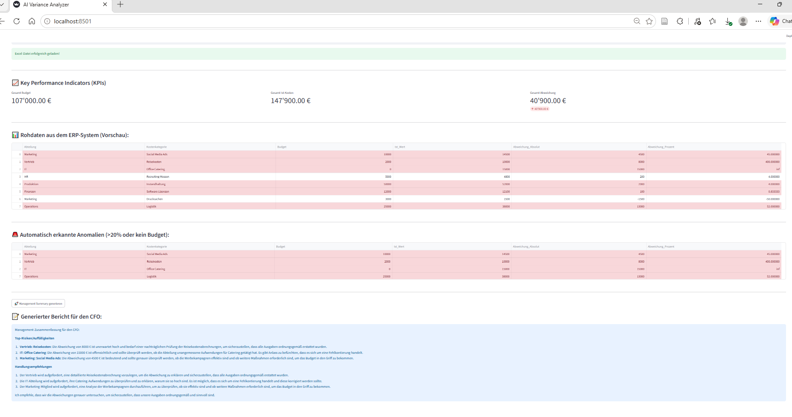

# Simples-Controlling-dashboard (Lernprojekt)

Ein lokal lauffähiger Prototyp für ein automatisiertes monatliches Abweichungs-Controlling. Die App demonstriert, wie standardisierte ERP-Exporte (Soll-/Ist-Vergleiche) automatisiert eingelesen, visuell aufbereitet und mithilfe eines lokalen KI-Sprachmodells voranalysiert werden können.

## ⚙️ Funktionsweise des Prototyps
* **Datenimport:** Einfacher Datei-Uploader für monatliche Excel-Berichte (`.xlsx`).
* **Visuelle Aufbereitung:** Tabellarische Übersicht mit automatischen KPI-Karten (Gesamtbudget, Ist-Kosten, Abweichung) und farblicher Hervorhebung von Budgetüberschreitungen zur schnelleren Orientierung.
* **Regelbasierte Vorfilterung:** Mathematische Eingrenzung von Auffälligkeiten (Abweichungen >20% oder unbudgetierte Kosten), um nur relevante Datenpunkte zu betrachten.
* **Lokale Textgenerierung (Datenschutzkonform):** Erste automatisierte Erstellung eines Berichts-Entwurfs durch die Anbindung an ein lokal installiertes Sprachmodell (**Ollama / Llama 3**) via Python-API.

## 🛠️ Tech Stack
* **Oberfläche:** Streamlit
* **Datenlogik:** Pandas (Python)
* **KI-Schnittstelle:** Ollama API (Llama 3)
---
*Dieses Projekt wurde als praxisnahes Lernprojekt entwickelt, um die Einsatzmöglichkeiten von Python und lokalen Open-Source-LLMs im modernen Financial Controlling zu evaluieren.*
